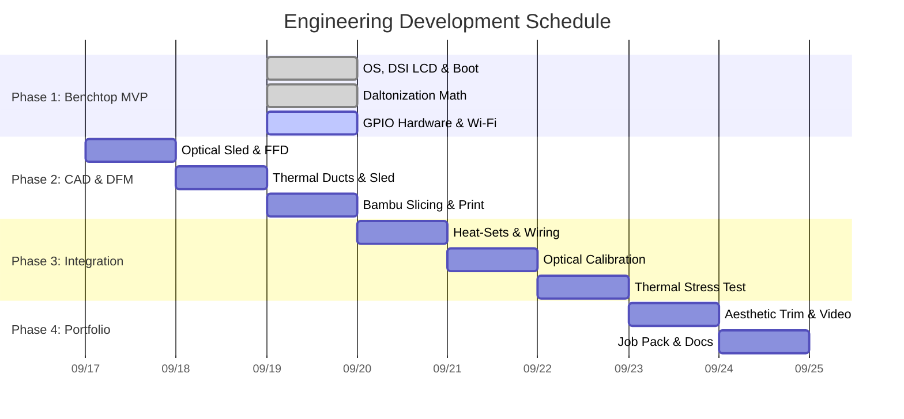

# modular-colourblind-camera
A custom Linux-based modular camera system including precision-toleranced 3D printed mechanics, swappable vintage optics, and real-time OpenCV Daltonisation pipeline designed for colourblind accessibility. 

